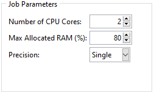

Adjusting Job Parameters
========================

For each analysis, a job is defined. The main parameters of the job can (and should) be adjusted to satisfy accuracy and time constraints. Note that in a batch analysis these parameters are used for all models. Therefore, care should be taken to select a set of parameters suitable for all analysis. If a model needs a different set, it should be run as a single analysis.

Adjusting Job Parameters using the GUI
---------------------------------------

The *Job Parameters* frame of the analysis tab can be seen in :numref:`job-parameters-frame`. It should be noted that the API offers a more complete list of options.

    
    Job parameters frame with the default values.

Adjusting Job Parameters using the API
---------------------------------------

Job parameters are defined by defining a *JobParams* object. A list of all attributes and their significance can be found in :class:`.classes.auxetic_structure_params.JobParams`. An example is shown below:

.. code-block:: python2
  
  # Define the job_params object.
  # Undefined attributes default to None.
  job_params = JobParams(
      description          = 'This is a sample job.',
      numCpus              = 4 ,
      memoryPercent        = 80,
      explicitPrecision    = 'SINGLE',
      nodalOutputPrecision = 'SINGLE',
  )