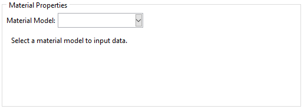

Assigning Material Properties
=============================

A number of different material properties can be defined using this software. These are all available in the GUI and API but, as with any Abaqus analysis, care should be taken to define only the necessary material properties. Furthermore, some definitions may not be compatible with each other. For example, elastic and hyperelastic properties can be defined together, but will raise an error in the analysis. Finally, all material property data is passed to the Abaqus API. Any invalid inputs are either caught by the API or result in failed or erroneous analyses.

Assigning Material Properties using the GUI
-------------------------------------------

Currently, only elastic and hyperelastic material properties can be defined using the GUI. This may be updated in the future. :numref:`material-properties-frame` shows the relavant frame in the analysis tab. After selecting a material mode, the relavant data can be input.

    
    Material Properties frame.

Assigning Material Properties using the API
-------------------------------------------

Material properties are defined by defining a *MaterialParams* object. A list of all attributes and their significance can be found in :class:`.classes.auxetic_structure_params.MaterialParams`.

As an example, the following script defines a *MaterialParams* object with *density* and *hyperelastic* attributes.

.. code-block:: python2
  
  # Define the material_params object.
  # Undefined attributes default to None.
  material_params = MaterialParams(
      density      = 1.00,
      hyperelastic = ('marlow',
                      (
                       (0.0    , 0.0     ),
                       (1.87019, 0.021918),
                       (3.76788, 0.041096),
                       (5.63806, 0.062101),
                       (7.48075, 0.086758),
                       (9.15842, 0.122374),
                       (10.4785, 0.170776),
                       (11.4686, 0.226484),
                       (12.3212, 0.285845),
                       (13.0638, 0.346119),
                       (13.7514, 0.407306),
                       (14.5215, 0.468493),
                       (15.4015, 0.526941),
                       (16.3916, 0.583562),
                       (17.3542, 0.641096),
                       (18.2893, 0.699543),
                       (19.2244, 0.757078),
                       (20.242 , 0.812785),
                       (21.3146, 0.866667),
                       (22.3872, 0.921461),
                       (23.4598, 0.977169),
                       (24.5325, 1.03288 ),
                       (25.6601, 1.08676 ),
                       (26.7877, 1.14064 ),
                       (27.8603, 1.19543 ),
                       (28.8779, 1.25205 ),
                       (29.868 , 1.30868 ),
                       (30.7756, 1.36621 ),
                       (31.6832, 1.42557 ),
                       (32.5908, 1.48402 ),
                       (33.4983, 1.54247 ),
                       (34.3784, 1.60091 ),
                       (35.286 , 1.65936 ),
                       (36.1661, 1.71781 ),
                       (37.0462, 1.77626 ),
                       (37.9813, 1.8347  ),
                       (38.8889, 1.89315 ),
                       (39.824 , 1.9516  ),
                       (40.7591, 2.00913 ),
                       (41.7217, 2.06667 ),
                       (42.6843, 2.1242  ),
                       (43.7019, 2.18082 ),
                       (44.7195, 2.23653 ),
                       (45.7096, 2.29315 ),
                       (46.6997, 2.34977 ),
                       (47.7173, 2.40639 ),
                       (48.6249, 2.46484 ),
                       (49.505 , 2.5242  ),
                       (50.44  , 2.58265 ),
                       (51.4301, 2.63927 ),
                       (52.3927, 2.6968  ),  
                       (53.3828, 2.75434 ),  
                       (54.3454, 2.81096 ),  
                       (55.198 , 2.87032 ),  
                       (55.8581, 2.93242 )  
                      )
  )
  
  # Note that the above tuple can be defined in a single line
  # this is only recommended after a successful analysis.
  # Also, any errors (sorting, etc.) are only caught by Abaqus.