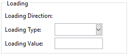

Defining Boundary Conditions
============================

The software defines two boundary conditions (BCs) on every model. These are applied to reference points (RPs) which are tied to suitable geometry using multi-point constraint equations. They are as follows:

  1. An Encastre (fixed) boundary condition is defined on the 'RP-1-set' reference point. This means that all points tied to this RP are fixed in all translational and rotational directions. This BC is applied starting from the *Initial* step.
  
  2. A second boundary condition is applied in the first (and only) step on the 'RP-1-set' reference point. Currently, the following loadings are available:
    
    + **Uniaxial Monotonic Displacement BC**: Only one value is required.
    + **Uniaxial Monotonic Concentrated Force**:  Only one value is required.

It should be noted that the of the loading influences the ribbons created for the structure (see :doc:`assembling-unit-cells`). The boundary condition is applied based on *Structure Type* defined when creating the structure. See :doc:`different-structure-modes` for a list of structure types and the boundary conditions applied to them.

When running a batch analysis, these parameters are used for all models. If a model needs different boundary conditions, it should be run as a separate analysis.

    
Defining Boundary Conditions using the GUI
------------------------------------------

The *Loading Parameters* frame of the analysis tab can be seen in :numref:`loading-parameters-frame`.

    
    The loading parameters frame.

Defining Boundary Conditions using the API
------------------------------------------

Job parameters are defined by defining a *LoadingParams* object. A list of all attributes and their significance can be found in :class:`.classes.auxetic_structure_params.LoadingParams`. An example is shown below:

.. code-block:: python2
  
  # Define the loading_params object
  # for a displacement in the x direction.
  loading_params = LoadingParams(
      type      = 'disp',
      direction = 'x'   ,
      data      = 20.0
  )