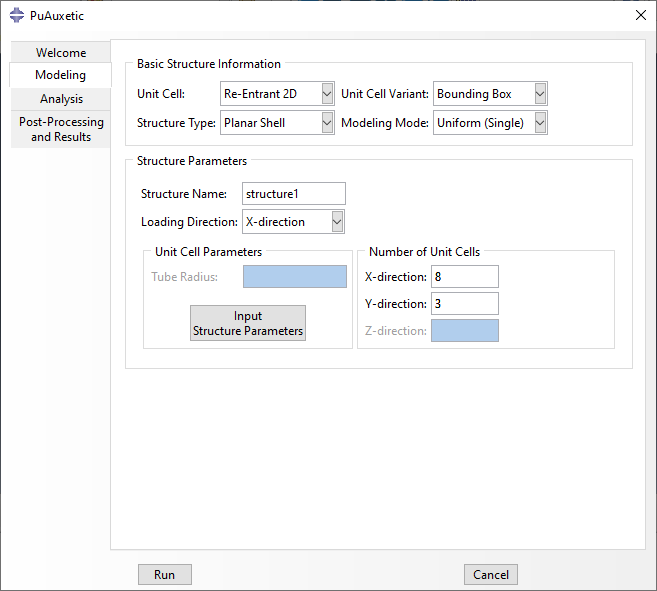
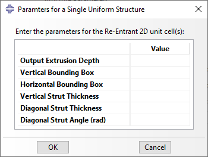
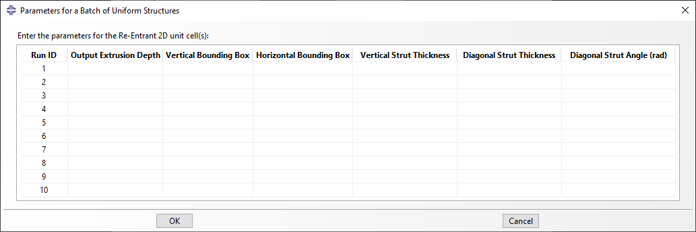

Defining Unit Cells
=======================

Introduction
------------

In the context of this software, the unit cell is defined as the smallest repeating unit used to create a structure.

In order to define a unit cell, its geometrical dimensions must be input. A unit cell may be definable using multiple methods, each called a *variant*, but these only differ in their input values, not the resulting geometry. Henceforth, a set of the mentioned values are refered to a *unit cell parameters*.

There are two considerations when defining unit cell parameters:

  1. What *variant* of the unit cell is being defined? Each variant has differnt parameters and care must be taken not to mistake them for each other. The desired variant can easily be selected both in the GUI and the API.
  
  2. How many unit cells must be defined? For a single homogenous structure only a single set of unit cell parameters is required. However, there are two situations that call for a list of unit cell parameters to be defined:
    
    + Multiple homogenous structures are being created as a consecutively as a *batch analysis* (See :doc:`batch-modeling`).
    + Although a structure can only be made of instances of a single unit cell, homogeneity is not required which means that many different unit cells can be defined for different parts of a structure (See :doc:`assembling-unit-cells`).

Defining Unit Cells using the GUI
---------------------------------

The first step is to specify the basic structure information. These include:

  + **Unit Cell**: Determines the unit cell used to create the structure.
  + **Unit Cell Variant**: A unit cell may be definable using multiple methods which are listed here. The choice of *Unit Cell* and *Unit Cell Variant* determines the unit cell parameters which must be input in the future.
  + **Structure Type**: Discussed in #TODO.
  + **Modeling Mode**: Three choices are available: *Uniform (Single)*, *Uniform (Batch)*, and *Non-Uniform*. The first calls for a single set of unit cell parameters and the other two require a list of unit cell parameters.

    
    Basic structure information in the modeling tab.

After a combination of parameters are specified in *Basic Structure Information*, the *Structure Parameters* frame is automatically activated for that combination. Contents of this frame depend on the structure, but can include the following:

  + **Structure Name/Prefix**: The name given to the structure, or the prefix used for a batch analysis.
  + **Loading Direction**: Discussed in :doc:`assembling-unit-cells`.
  + **Unit Cell Parameters Frame**: A button which opens a window in which unit cell parameters can be specified. For non-uniform structures, the window also asks for the *Structure Map* (See :doc:`assembling-unit-cells`). This frame also has any possible parameters needed for the selected *Structure Type*. This is discussed in length in #TODO.
  + **Number of Unit Cells Frame**: This frame is only shown for uniform (single and batch) structures. Depending on the unit cell, number of unit cells in the x, y, and z direction can be specifed.

Title of the push button described above changes based on *Modeling Mode*. Regardless, it opens a new pop-up window which asks for the required parameters.

For *Uniform* structures, the window includes only a table asking for the unit cell parameters needed for the selected unit cell variant. Unit cell ID is automatically set to 1. A sample window is shown in :numref:`sample-uniform-unit-cell-params`.

    
    Structure Parameters pop-up window for a uniform (single) structure.

If *Uniform (Batch)* or *Non-Uniform* modeling modes are selected, the pop-up window asks for a list of unit cell parameters in tabular format. Here, each row has a unit cell ID, which is used as analysis ID for batch modeling. Use of unit cell ID in non-uniform structures is discussed in :doc:`assembling-unit-cells`. A sample window is shown in :numref:`sample-batch-unit-cell-params`.

    
    Structure Parameters pop-up window for a uniform (batch) structure.

Defining Unit Cells using the API
---------------------------------

The mentioned options and parameters can also be specifed using the API. The first variable is `structure_type`, which simultaneously selects the *Unit Cell Name* and its *Structure Type*. For example:

.. code-block:: python2
  
  # Define a Re-Entrant 2D unit cell for a planar shell structure.
  structure_type = 'reentrant2d_planar_shell'

Unit cell parameters are defined as subclasses of :class:`namedtuple`, which are defined in :mod:`.classes.auxetic_unit_cell_params`. For example, the *Re-Entrant 2D* unit cell can be defined using three different subclasses of :class:`namedtuple`, namely:

  + :class:`.classes.auxetic_unit_cell_params.Reentrant2DUcpFull`
  + :class:`.classes.auxetic_unit_cell_params.Reentrant2DUcpBox`
  + :class:`.classes.auxetic_unit_cell_params.Reentrant2DUcpSimple`

The geometrical significance of these definition methods are explained in depth in #TODO. The API expects one of these or a homogenous Iterable of one of these depending on how many are necessary. It then makes sure that the list includes only one definition method and that it is relevant to the selected unit cell. Two examples are shown below:

First, the necessary libraries must be imported:

.. code-block:: python2
  
  # Import the necessary libraries:
  from pyauxetic.classes.auxetic_unit_cell_params import *
  from pyauxetic.classes.auxetic_structure_params import *
  
  ## A single set of unit cell parameters:
  # Method 1:
  unit_cell_params = Reentrant2DUcpBox(
      id                   = 1  ,
      extrusion_depth      = 5  ,
      horz_bounding_box    = 20 ,
      vert_bounding_box    = 24 ,
      vert_strut_thickness = 2  ,
      diag_strut_thickness = 1.5,
      diag_strut_angle     = 70
      )
  
  # Method 2:
  unit_cell_params = Reentrant2DUcpBox(1, 5, 20, 24, 2, 1.5, 70)
  
  ## A list of unit cell parameters:
  # Define three unit cells for a non-uniform structure or a batch of uniform structures.
  # Note that the first argument (id) is unique for each unit cell.
  unit_cell_params_list = []
  # (id, extrusion_depth, horz_bounding_box, vert_bounding_box,
  #  vert_strut_thickness, diag_strut_thickness, diag_strut_angle)
  unit_cell_params_list.append( Reentrant2DUcpBox(1, 5, 20, 24, 3.0, 1.5, 60) )
  unit_cell_params_list.append( Reentrant2DUcpBox(2, 5, 20, 24, 3.0, 1.5, 60) )
  unit_cell_params_list.append( Reentrant2DUcpBox(3, 5, 20, 24, 2.0, 1.5, 60) )