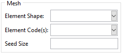

Meshing the Structure
=====================

For each analysis, meshing parameters can be defined. These are then applied to the structure. If batch modeling and analysis is performed, the parameters are used for all models regardless of geometry. Care should be taken to select suitable values and run problematic geometries separately.

Meshing the Structure using the GUI
-----------------------------------

The *Mesh Parameters* frame of the analysis tab can be seen in :numref:`mesh-parameters-frame`. It should be noted that the API offers a more complete list of options. Also, *Element Code* drop-down menu only contains a limited number of element codes. More element codes can be easily added upon request.

    
    The mesh parameters frame.

Meshing the Structure using the API
-----------------------------------

Mesh parameters are defined by defining a *MeshParams* object. A list of all attributes and their significance can be found in :class:`.classes.auxetic_structure_params.MeshParams`. An example is shown below:

.. code-block:: python2
  
  # Define the mesh_params object.
  # Undefined attributes default to None.
  mesh_params = MeshParams(
      seed_size    = 1.0       ,
      elem_shape   = 'QUAD'    ,
      elem_code    = ('CPE4H') ,
      elem_library = 'STANDARD'
  )