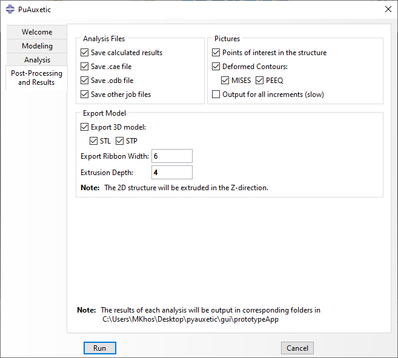

Requesting Output
=================

The software automatically saves results of the analysis to the current working directory in a folder with the same name as the structure. These outputs generally fit in one of the following categories:

  + **Analysis Files**: These are the files created automatically by Abaqus. These include `.cae`, `.odb`, and various Abaqus input and log files.
  + **Numerical Results**: The software automatically processes the ODB and producess a suitable report in a tabular format. For batch analyses, this is done for each structure and an additional report is created which summarizes the results of all models.
  + **Graphic Results**: These are pictures of the structure before, after, and during analysis. They also include plots of the numerical results.
  + **Exported Model**: The created model can be exported in *STL* and *STP* formats. These can then be used in a variety of CAD software or additive manufacturing processors. The loading ribbons can have a new and separate width to accomodate testing and planar shell models are extruded by a given amount.

Requesting Output using the GUI
-------------------------------

All of the mentioned outputs can be seen the *Post-Processing and Results* tab of the GUI which is seen in :numref:``. Note that the API offers a more complete list of options and finer control over them.

    
    The Post-Processing and Results tab.

Requesting Output using the API
-------------------------------

Output requests are defined by defining a *OutputParams* object. A list of all attributes and their significance can be found in :class:`.classes.auxetic_structure_params.OutputParams`. An example is shown below:

.. code-block:: python2
  
  # Define the output_params object.
  # Undefined attributes default to None.
  output_params = OutputParams(
      result_folder_name     = None,
      save_cae               = True,
      save_odb               = True,
      save_job_files         = True,
      export_extrusion_depth = 5.0 ,
      export_ribbon_width    = 4.0 ,
      export_stl             = True,
      export_stp             = True
  )