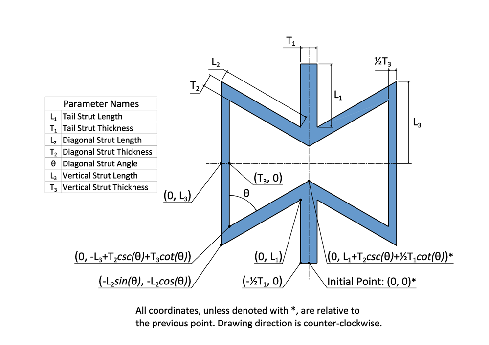
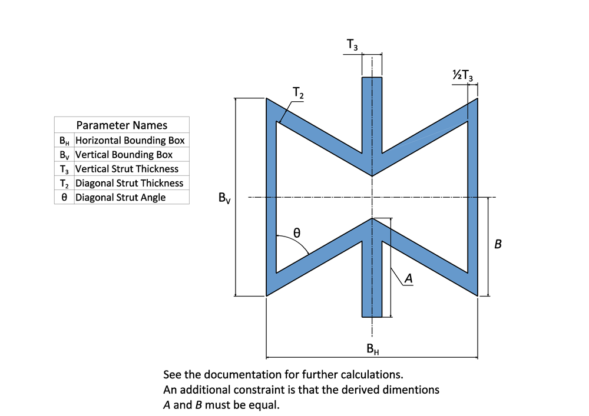
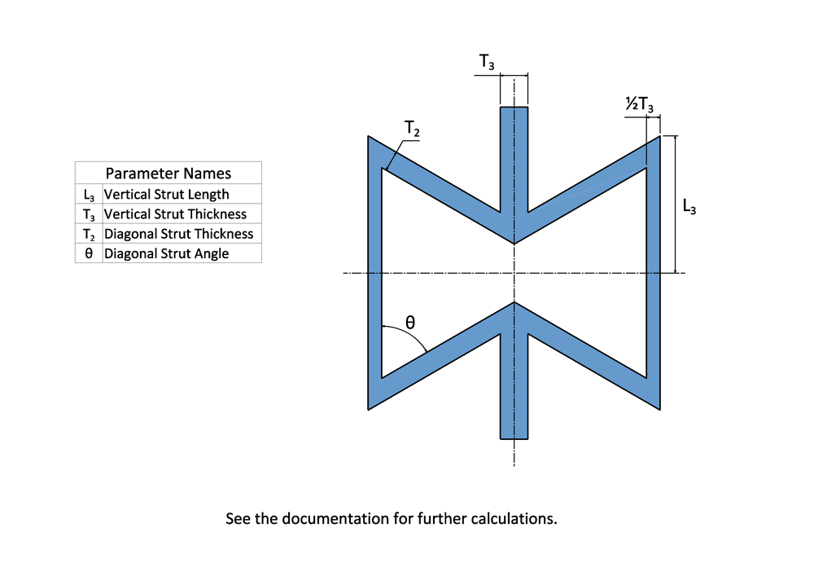
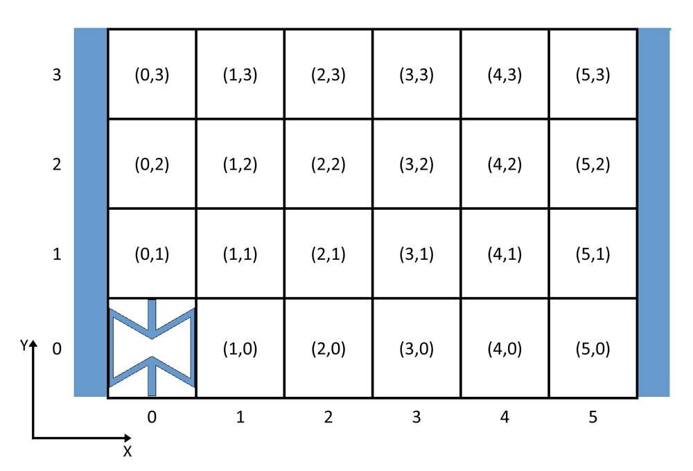

Re-Entrant 2D
=============

The Re-Entrant 2D is a two-dimensional unit cell that has been studied for a long time. It has been originally taken from the honeycomb strcuture [#TODO: write a paragraph and cite].

Variants
--------

Three variants have been defined for this unit cell. Use of the *Bounding Box* variant is strongly recommended.

Full Parameters
+++++++++++++++

This is the basic variant that gives the most amount of modeling freedom. All other variants are converted to this variant. Use of this variant for non-uniform strcutures is not recommended. :numref:`reentrant2d_full` shows this unit cell variant and the points that need to be traced to draw it.

    
    The 'Full Parameters' variant of the Re-Entrant 2D unit cell

After drawing a sketch based on the points in :numref:`reentrant2d_full`, the dimensional constraints are defined. It should be noted that only one quarter of the model is drawn, which is then mirrored twice to obtain the final sketch.

Unit cell parameters for this strcuture are defined using the :class:`.classes.auxetic_unit_cell_params.Reentrant2DUcpFull` class.

Bounding Box
++++++++++++

In order to assemble a non-uniform structure made from this unit cell, all unit cells must have the same bounding box and the other variants cannot be defined based on unit cell boudning box. This variant was developed to fill that need. :numref:`reentrant2d_box` shows this unit cell variant and its parameters.

    
    The 'Bounding Box' variant of the Re-Entrant 2D unit cell

The parameters are then converted into parameters for the *Full Parameters* variant based on the following equations (note the order of calculations):

.. math::
   :label: reentrant2d_box_eqs
   
   T_1'    &= T_1    \\
   T_2'    &= T_2    \\
   T_3'    &= T_3    \\
   \theta' &= \theta \\
   L_2' &= \frac{0.5 \, B_H - 0.5 \, T_3}{sin(\theta)} \\
   L_3' &= 0.5 \, B_V + L_2' \, cos(\theta) + \frac{T_2}{sin(\theta)} + \frac{0.5 \, T_3}{tan(\theta)} \\
   L_1' &= 0.5 \, L_3' - \frac{T_2}{sin(\theta)} - \frac{0.5 \, T_1}{tan(\theta)} \\

Unit cell parameters for this strcuture are defined using the :class:`.classes.auxetic_unit_cell_params.Reentrant2DUcpBox` class.

Simplified
++++++++++

This variant simplifies the parameters of the *Full Parameters* variant.
Use of this variant for non-uniform strcutures is not recommended. :numref:`reentrant2d_simple` shows this unit cell variant and its parameters.

    
    The 'Simplified' variant of the Re-Entrant 2D unit cell

The parameters are then converted into parameters for the *Full Parameters* variant based on Eqs. :eq:`reentrant2d_simple_eqs`. It should be noted that :math:`L_2'` is a dummy index and it's value will be modified using dimensional constraints when sketching the *Full Parameters* unit cell variant.

.. math::
   :label: reentrant2d_simple_eqs
   
   T_1'    &= T_3    \\
   T_2'    &= T_2    \\
   T_3'    &= T_3    \\
   \theta' &= \theta \\
   L_1' &= 0.5 \, L_3 - \frac{T_2}{sin(\theta)} - \frac{0.5 \, T_1}{tan(\theta)} \\
   L_2'    &= \frac{2}{3} \, L_3  \\
   L_3'    &= L_3    \\

Unit cell parameters for this strcuture are defined using the :class:`.classes.auxetic_unit_cell_params.Reentrant2DUcpSimple` class.

Assembly
--------

Assembly of this unit cell is very straightforward. The unit cells must satisfy two requirements:
  
  + They must have the same bounding box (height and width). As such, only the *Bounding Box* variant is guaranteed to work for non-uniform strcutures.
  + In the distance between the initial point in the unit cell and the final drawn point which is on top of it in :numref:`reentrant2d_full` must be the same for all models.

Assembly is performed as explained in :doc:`../getting-started/assembling-unit-cells`.

Currently, only shell structure model is supported which is assembled similar to :numref:`reentrant2d_shell-pattern`.

    
    Assembly structure map used for a shell Re-Entrant 2D structure.